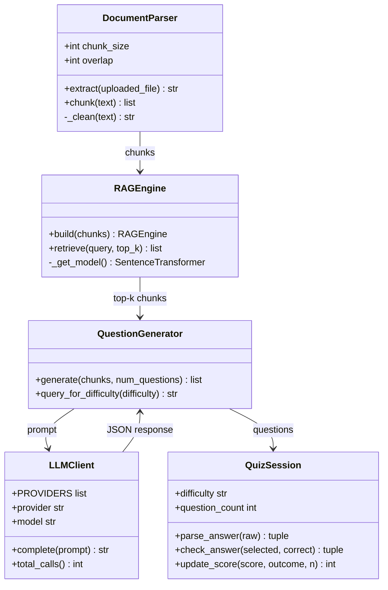
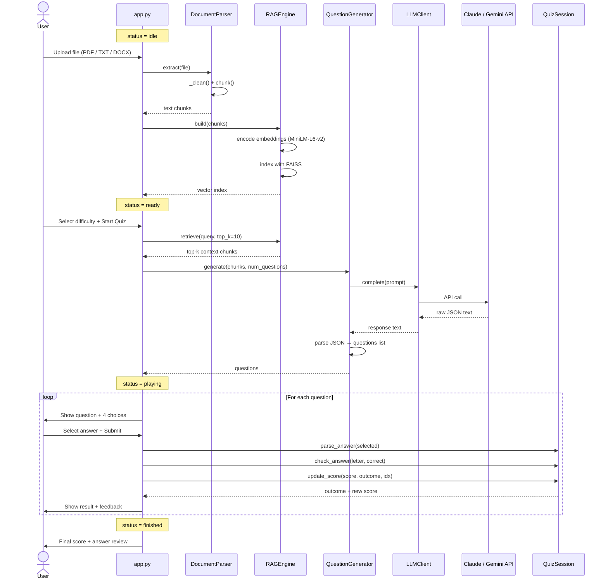
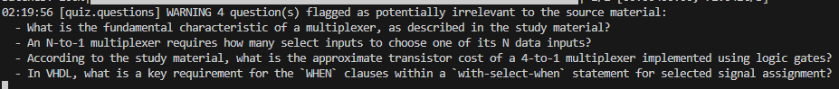
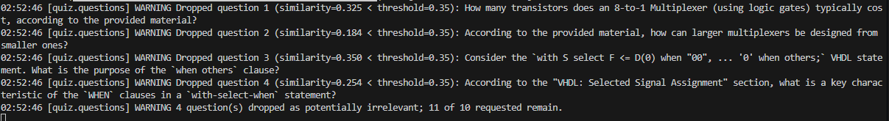
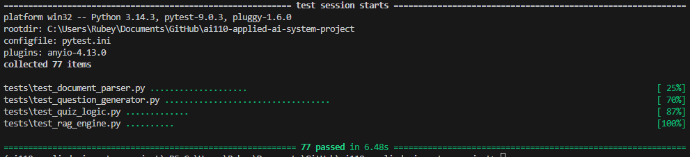

# QuizFoundry

Based on the [CodePath AI110: Game Glitch Investigator Assignment](https://github.com/Rubey4112/ai110-module1show-gameglitchinvestigator-starter). This was an assignment showing how to use AI as a debugging partner to identify bugs and fix them. The program itself was a simple number guessing game. If you guessed wrong, it tell you whether you guessed too high or too low.

## Purpose

This is a game-based learning platform where users generate custom study quizzes by uploading their class materials. A RAG (Retrieval-Augmented Generation) AI agent retrieves relevant information from the uploaded documents and generates a multiple-choice quiz tailored to the content. The goal is to make studying more interactive and personalized.

---

## Title and Summary

**QuizFoundry** is an AI-powered Streamlit web app that turns any study document into a playable quiz. Users upload a PDF, TXT, or DOCX file, choose a difficulty level, and the system uses semantic search to find the most relevant passages before prompting an LLM (Claude or Gemini) to generate multiple-choice questions from that content. The app tracks answers, gives immediate feedback, and shows a final score — making it easy to self-test on any material.

---

## Architecture Overview

The system is split into four layers:





**Key modules:**

| File | Responsibility |
|------|----------------|
| `app.py` | Streamlit UI; manages session state across 4 states: idle → ready → playing → finished |
| `quiz/pipeline.py` | `DocumentParser` (extract/clean/chunk) and `RAGEngine` (FAISS index + semantic retrieval) |
| `quiz/llm_client.py` | Unified LLM client with dry-run mode and Gemini rate-limit handling |
| `quiz/questions.py` | `QuestionGenerator` — builds prompts, parses JSON question responses |
| `quiz/session.py` | `QuizSession` — answer validation, scoring, question count by difficulty |

**Difficulty levels:**

| Level | Questions |
|-------|-----------|
| Easy  | 5         |
| Normal | 10       |
| Hard  | 15        |

**Scoring:** Correct answer = `max(10, 100 − 10 × question_number)` points. Wrong answer = −10 points.

---

## Setup Instructions

**1. Clone the repository**
```bash
git clone https://github.com/your-username/ai110-applied-ai-system-project.git
cd ai110-applied-ai-system-project
```

**2. Install dependencies**
```bash
pip install -r requirements.txt
```

**3. Configure API keys**

Copy `.env.example` to `.env` and fill in your key(s):
```bash
cp .env.example .env
```
```
ANTHROPIC_API_KEY=your-anthropic-key-here
GEMINI_API_KEY=your-gemini-key-here
```
Only the key for the provider you select is required. You can also use **Dry Run** mode to test the full pipeline without any API key.

**4. Run the app**
```bash
python -m streamlit run app.py
```
The app will open at `http://localhost:8501`.

**5. Run tests**
```bash
pytest          # all tests
pytest -v       # verbose output
```

---

## Sample Interactions

### Example 1 — Easy quiz on an uploaded machine learning document

**Input:** User uploads `intro_to_machine_learning.txt` and selects **Easy** difficulty with **Claude** as the LLM provider, then clicks **Generate Quiz**.

**AI output (5 questions generated):**

> **Question 1:** What is the primary goal of supervised learning?  
> A) To cluster data without labels  
> B) To learn a mapping from inputs to outputs using labeled examples  
> C) To reduce the dimensionality of a dataset  
> D) To generate new data samples  
> *(Correct: B)*

> **Question 2:** Which of the following is an example of a classification task?  
> A) Predicting a house price  
> B) Estimating tomorrow's temperature  
> C) Identifying whether an email is spam or not spam  
> D) Forecasting stock market returns  
> *(Correct: C)*

After answering all 5 questions, the app displays: **Final Score: 370 / 500**

---

### Example 2 — Hard quiz on a biology document

**Input:** User uploads a 10-page PDF on cellular biology and selects **Hard** difficulty with **Gemini**, then clicks **Generate Quiz**.

**AI output (excerpt — 15 questions generated):**

> **Question 3:** What is the function of the mitochondrial inner membrane?  
> A) It acts as a barrier preventing all molecule transport  
> B) It houses the electron transport chain and ATP synthase  
> C) It stores genetic material for the organelle  
> D) It directly synthesizes glucose from CO₂  
> *(Correct: B)*

The user answers incorrectly and sees: *"Wrong! The correct answer was B."* Score decreases by 10 points.

---

### Example 3 — Dry Run mode (no API key needed)

**Input:** User selects the sample material and enables **Dry Run** mode, then clicks **Generate Quiz**.

**AI output:** The app generates placeholder stub questions without calling any LLM API, allowing full end-to-end testing of the document parsing and RAG pipeline without incurring API costs.

---

## Design Decisions

The main constraint for this program is that I only have access to the free-tier of the Gemini API. That mean every API request, has to be rationed as to not hit the twenty request per day quota.

As such, this program implement RAG rather send the whole document since large documents exceed LLM context limits and increase cost. The document pipeline support PDF, DOCX, and TXT for parsing text. These text are then chunked and indexed by FAISS. By chunking the document and using semantic search (FAISS + sentence-transformers) to retrieve only the most relevant passages, the system sends relevant context to the LLM. This improves question quality and keeps API costs low. 

I also implemented a dry run mode thast lets developers verify the document parsing, chunking, and retrieval steps (i.e. the RAG pipeline) without actually sending the API request to the AI agent. This helped tremendously during debugging or testing new features.

This also restrict how I can guardrail this model. Ideally, I would use an agentic system where the generated questions are then sent back to the LLM to verify. Since that would caused every quiz to take twice the API call, I ended up choosing to check whether each question is relevant to the material by doing a sementic similarity search within the FAISS index. It's not perfect but it does filter out most of the question that isn't relevant to the material. This also mean that I have to generate 50% more question for each difficulty, i.e. 15 questions for Normal (10 questions) since some of the questions will be dropped. Below are some screenshot of the guardrail in action:





---

## Testing Summary



**What was tested:**

| Test file | Module | # Tests |
|-----------|--------|---------|
| `test_document_parser.py` | `DocumentParser` | 28 |
| `test_rag_engine.py` | `RAGEngine` | 14 |
| `test_question_generator.py` | `QuestionGenerator` | 20 |
| `test_quiz_logic.py` | `QuizSession` | 16 |

**What worked:**  
The document parsers worked. It was quite robust actually. Although I didn't realize that at the time since I didn't have a logging system.

**What didn't work initially:**  
Testing the AI quiz generations didn't work initially since the Gemini API was throwing a 429 rate limit error. I initially thought that was because of my Gemini free-tier, but turnout, it was because I choose an obsolete Gemini model that Google doesn't support anymore.

**What was learned:**  
Utilizing object-oriented programming principles helped me signficantly during debugging. In the advent of an error, it allowed me to trace the error back to the one object that own the problematics function, rather than being buried in a web of functional call.
Always ensure that there is *some* logging system in an application that has to rely on API calls and whose API calls are have rate/quota limit or cost money to use. You can't guide an AI agent to fix an error if you're not sure of what the error is.
Futhermore, unit test and 

---

## Reflection

**What are the limitations or biases in your system?**
Limitations and biases are mentioned in the [Model Card](model_card.md)

**Could your AI be misused, and how would you prevent that?**
People are very ingenious so no doubt there is a case where this AI system can be misused. But this AI agent is guarded against the action of a student wanting to just get the answer to problem.

**What surprised you while testing your AI's reliability?**
My question relevance check actually works. I won't have thought such a simple idea of checking the AI generated question against the materials can catch irrelevant question quite well.

**Describe your collaboration with AI during this project. Identify one instance when the AI gave a helpful suggestion and one instance where its suggestion was flawed or incorrect.**
One helpful suggestion the AI gave me was guiding me toward the relevance check algorithm that I mentioned above. I already conecptualize the system and how it achieve the goal of guardrailing the AI but I didn't know how to actually implement it. But since I had a clear idea of what I want, guiding the AI to implement it was trivial.

On flawed suggestion that the AI gave me was using in Gemini-2.0-flash as the default Gemini model. Google deprecated the model and it is not accesible via the API anymore. The result was the API call returned an 429 rate limit error, which lead me to the wrong path when trying to debug the problem. Switching the model to Gemini-2.5-flash fixes that problem.


## Demo

[Demo Video Link](https://youtu.be/XQak2eVWt34)