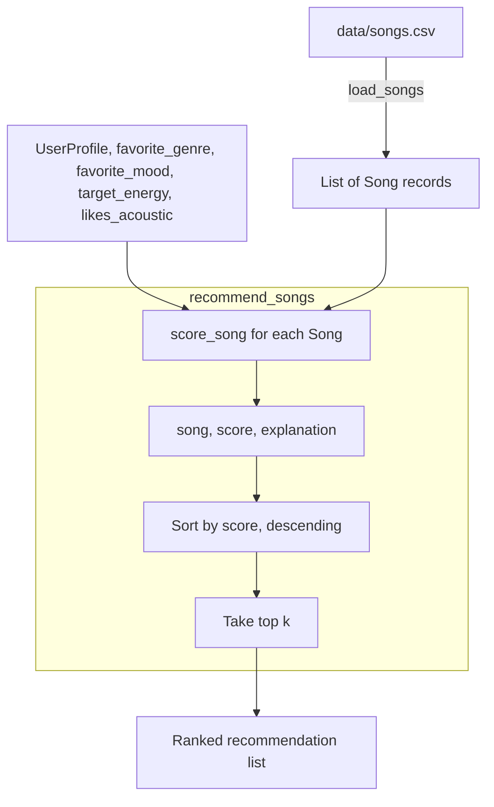

# 🎵 Music Recommender Simulation

## Project Summary

In this project you will build and explain a small music recommender system.

Your goal is to:

- Represent songs and a user "taste profile" as data
- Design a scoring rule that turns that data into recommendations
- Evaluate what your system gets right and wrong
- Reflect on how this mirrors real world AI recommenders

Replace this paragraph with your own summary of what your version does.

---

## How The System Works

**Real-world systems (Spotify/YouTube)**: These platforms rank content using two blended signals — collaborative filtering, which mines what millions of other users listened to, liked, skipped, or added to playlists to find "people like you also loved X," and content-based filtering, which matches a song or video's own attributes (genre, tempo, mood, energy) against your inferred taste profile. Collaborative signals dominate once enough behavioral data exists and surface non-obvious recommendations, while content signals handle cold-start cases (brand-new songs/users) and provide explainability.

**This system**: This recommender is a simplified, purely content-based version of that second half. It has no user population or listening history to mine — just a small Song catalog with hand-authored attributes (genre, mood, energy, tempo, valence, danceability, acousticness) and a single UserProfile describing one person's stated preferences (favorite genre/mood, target energy, acoustic preference). score_song compares each song's attributes to the user's profile and produces a numeric score plus a plain-language reason, and recommend_songs ranks the full catalog by that score and returns the top k — the same core mechanic real systems use for their content-based half, just without the collaborative, population-scale layer on top.



`score = w1*(1 - |energy_diff|) + w2*acoustic_match + w3*genre_bonus + w4*mood_bonus`, with w1, w2 largest since those two features have the most spread and best map to explicit user intent.

---

## Getting Started

### Setup

1. Create a virtual environment (optional but recommended):

   ```bash
   python -m venv .venv
   source .venv/bin/activate      # Mac or Linux
   .venv\Scripts\activate         # Windows

2. Install dependencies

```bash
pip install -r requirements.txt
```

3. Run the app:

```bash
python -m src.main
```

### Running Tests

Run the starter tests with:

```bash
pytest
```

You can add more tests in `tests/test_recommender.py`.

---

## Sample Recommendation Output

```
Sunrise City - Score: 0.94
Because: matches your favorite genre (pop); matches your favorite mood (happy); energy 0.82 is 0.02 away from your target 0.80; non-acoustic preference matches this song's acousticness (0.18)

Gym Hero - Score: 0.83
Because: matches your favorite genre (pop); energy 0.93 is 0.13 away from your target 0.80; non-acoustic preference matches this song's acousticness (0.05)

Rooftop Lights - Score: 0.68
Because: matches your favorite mood (happy); energy 0.76 is 0.04 away from your target 0.80; non-acoustic preference matches this song's acousticness (0.35)

Crown Speak - Score: 0.68
Because: energy 0.80 is 0.00 away from your target 0.80; non-acoustic preference matches this song's acousticness (0.08)

Broken Chain Riot - Score: 0.65
Because: energy 0.90 is 0.10 away from your target 0.80; non-acoustic preference matches this song's acousticness (0.05)
```

```
# e.g.:
# User profile: genre=indie, mood=chill, energy=low
# Recommendations:
#   1. ...
#   2. ...
#   3. ...
```

**Screenshot or video** *(optional)*: <!-- Insert a screenshot or demo video link here -->

---

## Experiments You Tried

Use this section to document the experiments you ran. For example:

- What happened when you changed the weight on genre from 2.0 to 0.5
- What happened when you added tempo or valence to the score
- How did your system behave for different types of users

---

## Limitations and Risks

Summarize some limitations of your recommender.

Examples:

- It only works on a tiny catalog
- It does not understand lyrics or language
- It might over favor one genre or mood

You will go deeper on this in your model card.

---

## Reflection

Read and complete `model_card.md`:

[**Model Card**](model_card.md)

Write 1 to 2 paragraphs here about what you learned:

- about how recommenders turn data into predictions
- about where bias or unfairness could show up in systems like this


