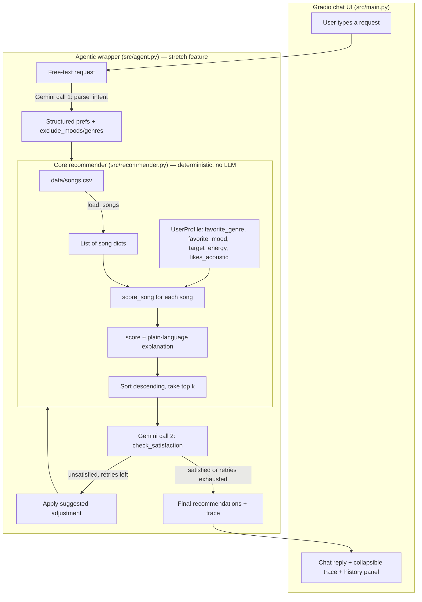

# 🎵 TuneMatch — A Content-Based Music Recommender + Agentic Wrapper

## Original Project (Modules 1–3)

This project started as [**Music Recommender Simulation**](https://github.com/Rubey4112/ai110-module3show-musicrecommendersimulation-starter/tree/tech-fellow), a CodePath classroom exercise: build and explain a small, content-based music recommender. The starter goal was to represent songs and a user "taste profile" as data, design a scoring rule that turns that data into ranked recommendations, evaluate what the system gets right and wrong, and reflect on how it mirrors real-world recommenders like Spotify or YouTube. The starter code shipped with the data model in place but the scoring and ranking logic left as empty `TODO`s.

This repo is my completed version of that project (I called it **TuneMatch**), plus a stretch feature I added on top: an agentic layer that lets a user describe what they want in plain English instead of filling out a structured profile by hand.

---

## Summary

TuneMatch ranks a small, hand-curated song catalog against a user's stated music taste and returns the top 5 matches with a plain-language explanation for each — e.g. *"matches your favorite genre (rock); energy 0.91 is 0.01 away from your target 0.90."* The core recommender is a deterministic, weighted content-based scorer: no black box, no hidden model, every number in the final score is traceable back to a specific comparison.

On top of that core, I built an **agentic wrapper** (`src/agent.py`) that accepts free-text requests like *"chill lofi for studying, not too sad"*, uses Gemini to translate that into the recommender's structured input, runs the *existing, unmodified* scorer, and then asks Gemini to judge whether the results actually satisfy the request — retrying with an adjustment (e.g. excluding a mood) if they don't.

Why it matters: this is a small, fully inspectable case study in the same mechanic that powers real recommendation engines — turning attributes and preferences into a ranked list — plus a demonstration of how to wrap a deterministic tool in an LLM-driven plan → act → check → revise loop without letting the LLM touch the actual scoring logic. Keeping the scorer untouched by the LLM was a deliberate choice: the agent handles language understanding, the tested/auditable rule engine handles arithmetic.

---

## Architecture Overview

**Two layers, one direction of dependency.** The agent and UI call into the recommender; the recommender knows nothing about either of them.



- **`src/recommender.py`** — the graded core. `Song`/`UserProfile` dataclasses, a CSV loader, and the scoring function: `score = 0.4·energy_match + 0.3·acoustic_match + 0.2·genre_match + 0.1·mood_match`. Pure functions, no I/O beyond reading the CSV, no network calls — this is what the unit tests target.
- **`src/agent.py`** — the stretch feature. Two Gemini calls (parse intent, check satisfaction) wrapped around one call to the unmodified `recommend_songs()`. Bounded retry loop (default cap: 2) so it can't loop forever or let the LLM hallucinate catalog entries.
- **`src/main.py`** — a Gradio chat UI: a session list, the chat itself, and a running history panel of past requests/recommendations in the current session. This is the primary way to try the whole system end to end.

Full design notes and open questions from before I built the agent are in [diagrams/plan.md](diagrams/plan.md).

---

## Setup Instructions

1. **Clone the repo and create a virtual environment** (recommended):

   ```bash
   python -m venv .venv
   source .venv/bin/activate      # Mac/Linux
   .venv\Scripts\activate         # Windows
   ```

2. **Install dependencies:**

   ```bash
   pip install -r requirements.txt
   ```

3. **Set up a Gemini API key** (only required for the agentic UI/CLI, not for the core recommender or its tests):
   - Get a free key from [Google AI Studio](https://aistudio.google.com/apikey).
   - Copy `.env.example` to `.env` and fill in `GEMINI_API_KEY`.

4. **Run the chat UI:**

   ```bash
   python -m src.main
   ```

   Opens a local Gradio app at `http://127.0.0.1:7860`. Type a free-text request (e.g. *"chill lofi for studying, not too sad"*) and watch it get parsed, scored, and self-checked in real time.

   Prefer a terminal-only look at the trace? Run the CLI version instead:

   ```bash
   python -m src.agent_main
   ```

5. **Run the tests:**

   ```bash
   pytest
   ```

   All 12 tests run offline — the agent tests mock the Gemini calls, so no API key or network access is needed to verify correctness.

---

## Sample Interactions

### 1. A clean, well-matched request (chat UI)

**Input:** `"I want deep, intense rock — high energy"`

**Output (top result):**
```
Storm Runner — score 0.97
matches your favorite genre (rock); matches your favorite mood (intense);
energy 0.91 is 0.01 away from your target 0.90; non-acoustic preference
matches this song's acousticness (0.10)
```
All three signals (genre, mood, energy) line up with an actual catalog entry, so the score is high and the explanation reads as a confident, unambiguous match.

### 2. A request with a negative constraint (agentic retry in action)

**Input:** `"chill lofi for studying, not too sad"`

**Trace:**
```
🔍 Parsed intent: chill lofi request, energy≈0.35, excluding mood "sad"
🔁 Retry — adjusting query: top result had mood "moody", flagged as sad-adjacent
✅ Self-check passed
```
The parser correctly turned "not too sad" into an exclusion the scorer can't express on its own. The first pass still surfaced a mood the self-check considered too close to "sad," so the agent excluded it and re-ran the *same* deterministic scorer — the retry changed the candidate pool, not the scoring rule.

### 3. A self-contradictory profile (stress test, run directly against the core recommender)

**Input:** `favorite_genre="metal", favorite_mood="angry", target_energy=0.95, likes_acoustic=True`

**Output (top result):**
```
Iron Fury — score 0.70
matches your favorite genre (metal); matches your favorite mood (angry);
energy 0.97 is 0.02 away from your target 0.95; acoustic preference does
not match this song's acousticness (0.02)
```
This profile asks for both near-max energy *and* an acoustic sound — a combination that barely exists in the catalog (acoustic songs here are almost all low-energy). The system doesn't crash or refuse; it returns its best compromise and the explanation makes the tension visible (three matches, one explicit mismatch) instead of hiding it. See the [Experiments](#experiments-you-tried) section for how sensitive this particular profile is to the scoring weights.

More stress-test profiles (out-of-range energy, unknown genre, empty preferences) are logged in full in the [Sample Recommendation Output](#sample-recommendation-output-detailed) section below.

---

## Design Decisions

- **Deterministic core, LLM only at the edges.** `score_song`/`recommend_songs` never call an LLM. The agent's two Gemini calls are strictly translation (free text → structured profile) and judgment (does the output satisfy the request) — never arithmetic. Trade-off: the agent can't invent a new scoring dimension on the fly (e.g. "danceable but not too fast") unless that dimension already exists in the scorer; but in exchange, every recommendation stays exactly as auditable as it was before the agent existed, and the well-tested core can't be silently broken by a bad LLM response.
- **Explanations are generated alongside the score, not after it.** `score_song` builds its `reasons` list from the same comparisons that produced the number, so the explanation can never drift out of sync with the score — there's no separate "explain" pass that could disagree with the ranking.
- **Filter from the original catalog on every retry, not from the previous attempt's output** (`apply_adjustment` in `src/agent.py`). Retries accumulate exclusions (e.g. "sad" then "moody") without compounding on top of whatever the last narrowed list happened to contain — this keeps multi-retry behavior predictable to reason about.
- **Hard retry cap (default 2), with an honest "best effort" fallback.** An LLM-in-the-loop check-and-revise cycle can plausibly disagree with itself forever on an ambiguous request. Capping retries and returning the best-effort list with a trace entry explaining *why* it gave up was chosen over either infinite retries (latency/cost risk) or silently returning as if satisfied (misleading).
- **Gradio over a custom frontend.** A chat UI with a session list and a history panel was enough to demo the full flow (request → parse → score → check → revise) without building auth, persistence, or a JS frontend. Trade-off: sessions are in-memory only — refreshing the page loses history — which is fine for a demo, not for a real product.
- **Hand-picked weights (0.4/0.3/0.2/0.1), not learned ones.** With no real user feedback to train against, learning weights would just be overfitting to my own guesses with extra steps. I made the weights explicit and testable instead, and used the [Experiments](#experiments-you-tried) section to show concretely what changing them does — which turned out to matter most exactly when a profile is self-contradictory (see the metalhead example above).

---

## Testing Summary

**What worked:** All 12 tests pass (`pytest`) — 2 for the core `Recommender`/`Song`/`UserProfile` data model, and 10 covering `score_song`/`recommend_songs` behavior and the agent's parse → act → check → revise loop, including both the "retries then succeeds" and "exhausts retries and returns best-effort" paths. The agent tests monkeypatch the single Gemini call site (`_call_gemini_json`) rather than mocking the whole `genai` client, so they run with no network access and no API key — useful for CI and for anyone cloning this repo without their own Gemini key.

I also manually stress-tested the core scorer against 8 hand-picked profiles (3 "clean" ones expected to match well, 5 adversarial ones: conflicting energy/mood, an out-of-range energy value, a genre absent from the catalog, an empty profile, and the self-contradictory acoustic-metalhead case above). None of them crashed the scorer — missing or invalid fields just fall back to defaults and the system leans on whatever signals remain valid. Full output is in [Sample Recommendation Output](#sample-recommendation-output-detailed).

**What didn't work / what I'd fix:** The weight-shift experiment (below) showed that reweighting `score_song` doesn't change the top pick for well-aligned profiles — it only reorders 4th/5th place — so tuning weights is a much weaker lever than I initially assumed, *except* on self-contradictory profiles, where it completely flips which conflicting signal wins. There's no ground-truth/labeled data for this recommender, so I can't say either weighting is "more correct" — only that they resolve conflicts differently. I also didn't get to genre-similarity matching (exact-string genre/mood matching is the single biggest gap — see [Limitations](#limitations-and-risks)); that's the first thing I'd build next, not a retry-safety-net or UI polish.

**What I learned:** small, deterministic systems are much easier to test meaningfully than LLM-driven ones — I can write exact assertions against `score_song`, but the agent tests can only assert on the *shape* of the retry loop (it excludes the flagged mood, it stops at the cap) because the actual Gemini judgment is mocked. That gap between "provably correct" and "plausibly correct" is a big part of what this project taught me about testing AI systems.

---

## Reflection

Building the scorer taught me that a recommender is really just "pick a few attributes, decide how to weigh disagreement between them, and be honest about the fact that the weights are a value judgment, not a discovered truth." There's no way to make `score_song` "more accurate" without labeled data telling you what a good recommendation actually is — all you can do is make its assumptions explicit and legible, which is exactly what the plain-language explanations are for.

Wrapping it in an agent taught me a narrower, more specific lesson: the highest-leverage place to bias-check a system like this isn't the LLM layer, it's the boring deterministic core — the catalog's genre distribution and the exact-string matching in `score_song` do more to narrow what a user ever sees than anything the agent's retry loop does. The agent can rephrase and retry, but it's still only ever choosing among songs the scorer was already capable of surfacing. That's the graded responsible-AI analysis I go into in depth in [model_card.md](model_card.md), including a specific helpful vs. flawed AI suggestion from building this and the system's concrete limitations.

---

## Sample Recommendation Output (detailed)

```
Sunrise City - Score: 0.94
Because: matches your favorite genre (pop); matches your favorite mood (happy); energy 0.82 is 0.02 away from your target 0.80; non-acoustic preference matches this song's acousticness (0.18)

Gym Hero - Score: 0.83
Because: matches your favorite genre (pop); energy 0.93 is 0.13 away from your target 0.80; non-acoustic preference matches this song's acousticness (0.05)

Rooftop Lights - Score: 0.68
Because: matches your favorite mood (happy); energy 0.76 is 0.04 away from your target 0.80; non-acoustic preference matches this song's acousticness (0.35)

Crown Speak - Score: 0.68
Because: energy 0.80 is 0.00 away from your target 0.80; non-acoustic preference matches this song's acousticness (0.08)

Broken Chain Riot - Score: 0.65
Because: energy 0.90 is 0.10 away from your target 0.80; non-acoustic preference matches this song's acousticness (0.05)
```

Stress Test with Diverse Profiles
```
=== Profile: High-Energy Pop ({'genre': 'pop', 'mood': 'happy', 'energy': 0.85}) ===
Top recommendations:

Sunrise City - Score: 0.93
Because: matches your favorite genre (pop); matches your favorite mood (happy); energy 0.82 is 0.03 away from your target 0.85; non-acoustic preference matches this song's acousticness (0.18)

Gym Hero - Score: 0.85
Because: matches your favorite genre (pop); energy 0.93 is 0.08 away from your target 0.85; non-acoustic preference matches this song's acousticness (0.05)

Broken Chain Riot - Score: 0.67
Because: energy 0.90 is 0.05 away from your target 0.85; non-acoustic preference matches this song's acousticness (0.05)

Rooftop Lights - Score: 0.66
Because: matches your favorite mood (happy); energy 0.76 is 0.09 away from your target 0.85; non-acoustic preference matches this song's acousticness (0.35)

Crown Speak - Score: 0.66
Because: energy 0.80 is 0.05 away from your target 0.85; non-acoustic preference matches this song's acousticness (0.08)


=== Profile: Chill Lofi ({'genre': 'lofi', 'mood': 'chill', 'energy': 0.35}) ===
Top recommendations:

Midnight Coding - Score: 0.76
Because: matches your favorite genre (lofi); matches your favorite mood (chill); energy 0.42 is 0.07 away from your target 0.35; non-acoustic preference does not match this song's acousticness (0.71)

Library Rain - Score: 0.74
Because: matches your favorite genre (lofi); matches your favorite mood (chill); energy 0.35 is 0.00 away from your target 0.35; non-acoustic preference does not match this song's acousticness (0.86)

Focus Flow - Score: 0.65
Because: matches your favorite genre (lofi); energy 0.40 is 0.05 away from your target 0.35; non-acoustic preference does not match this song's acousticness (0.78)

Island Sway - Score: 0.50
Because: energy 0.55 is 0.20 away from your target 0.35; non-acoustic preference matches this song's acousticness (0.40)

Spacewalk Thoughts - Score: 0.50
Because: matches your favorite mood (chill); energy 0.28 is 0.07 away from your target 0.35; non-acoustic preference does not match this song's acousticness (0.92)


=== Profile: Deep Intense Rock ({'genre': 'rock', 'mood': 'intense', 'energy': 0.9}) ===
Top recommendations:

Storm Runner - Score: 0.97
Because: matches your favorite genre (rock); matches your favorite mood (intense); energy 0.91 is 0.01 away from your target 0.90; non-acoustic preference matches this song's acousticness (0.10)

Gym Hero - Score: 0.77
Because: matches your favorite mood (intense); energy 0.93 is 0.03 away from your target 0.90; non-acoustic preference matches this song's acousticness (0.05)

Broken Chain Riot - Score: 0.69
Because: energy 0.90 is 0.00 away from your target 0.90; non-acoustic preference matches this song's acousticness (0.05)

Iron Fury - Score: 0.67
Because: energy 0.97 is 0.07 away from your target 0.90; non-acoustic preference matches this song's acousticness (0.02)

Neon Pulse Rave - Score: 0.67
Because: energy 0.95 is 0.05 away from your target 0.90; non-acoustic preference matches this song's acousticness (0.05)


=== Profile: Conflicting Energy/Mood ({'genre': 'rock', 'mood': 'sad', 'energy': 0.9}) ===
Top recommendations:

Storm Runner - Score: 0.87
Because: matches your favorite genre (rock); energy 0.91 is 0.01 away from your target 0.90; non-acoustic preference matches this song's acousticness (0.10)

Broken Chain Riot - Score: 0.69
Because: energy 0.90 is 0.00 away from your target 0.90; non-acoustic preference matches this song's acousticness (0.05)

Gym Hero - Score: 0.67
Because: energy 0.93 is 0.03 away from your target 0.90; non-acoustic preference matches this song's acousticness (0.05)

Iron Fury - Score: 0.67
Because: energy 0.97 is 0.07 away from your target 0.90; non-acoustic preference matches this song's acousticness (0.02)

Neon Pulse Rave - Score: 0.67
Because: energy 0.95 is 0.05 away from your target 0.90; non-acoustic preference matches this song's acousticness (0.05)


=== Profile: Out-of-Range Energy ({'genre': 'pop', 'mood': 'happy', 'energy': 1.5}) ===
Top recommendations:

Sunrise City - Score: 0.67
Because: matches your favorite genre (pop); matches your favorite mood (happy); energy 0.82 is 0.68 away from your target 1.50; non-acoustic preference matches this song's acousticness (0.18)

Gym Hero - Score: 0.66
Because: matches your favorite genre (pop); energy 0.93 is 0.57 away from your target 1.50; non-acoustic preference matches this song's acousticness (0.05)

Iron Fury - Score: 0.48
Because: energy 0.97 is 0.53 away from your target 1.50; non-acoustic preference matches this song's acousticness (0.02)

Neon Pulse Rave - Score: 0.46
Because: energy 0.95 is 0.55 away from your target 1.50; non-acoustic preference matches this song's acousticness (0.05)

Broken Chain Riot - Score: 0.45
Because: energy 0.90 is 0.60 away from your target 1.50; non-acoustic preference matches this song's acousticness (0.05)


=== Profile: Unknown Genre ({'genre': 'dubstep', 'mood': 'happy', 'energy': 0.7}) ===
Top recommendations:

Sunrise City - Score: 0.70
Because: matches your favorite mood (happy); energy 0.82 is 0.12 away from your target 0.70; non-acoustic preference matches this song's acousticness (0.18)

Rooftop Lights - Score: 0.67
Because: matches your favorite mood (happy); energy 0.76 is 0.06 away from your target 0.70; non-acoustic preference matches this song's acousticness (0.35)

Crown Speak - Score: 0.64
Because: energy 0.80 is 0.10 away from your target 0.70; non-acoustic preference matches this song's acousticness (0.08)

Night Drive Loop - Score: 0.61
Because: energy 0.75 is 0.05 away from your target 0.70; non-acoustic preference matches this song's acousticness (0.22)

Broken Chain Riot - Score: 0.60
Because: energy 0.90 is 0.20 away from your target 0.70; non-acoustic preference matches this song's acousticness (0.05)


=== Profile: Empty Preferences ({}) ===
Top recommendations:

Island Sway - Score: 0.56
Because: energy 0.55 is 0.05 away from your target 0.50; non-acoustic preference matches this song's acousticness (0.40)

Crown Speak - Score: 0.56
Because: energy 0.80 is 0.30 away from your target 0.50; non-acoustic preference matches this song's acousticness (0.08)

Noche Caliente - Score: 0.54
Because: energy 0.68 is 0.18 away from your target 0.50; non-acoustic preference matches this song's acousticness (0.30)

Night Drive Loop - Score: 0.53
Because: energy 0.75 is 0.25 away from your target 0.50; non-acoustic preference matches this song's acousticness (0.22)

Broken Chain Riot - Score: 0.52
Because: energy 0.90 is 0.40 away from your target 0.50; non-acoustic preference matches this song's acousticness (0.05)


=== Profile: Acoustic-Loving Metalhead ({'favorite_genre': 'metal', 'favorite_mood': 'angry', 'target_energy': 0.95, 'likes_acoustic': True}) ===
Top recommendations:

Iron Fury - Score: 0.70
Because: matches your favorite genre (metal); matches your favorite mood (angry); energy 0.97 is 0.02 away from your target 0.95; acoustic preference does not match this song's acousticness (0.02)

Mountain Promise - Score: 0.45
Because: energy 0.50 is 0.45 away from your target 0.95; acoustic preference matches this song's acousticness (0.75)

Coffee Shop Stories - Score: 0.44
Because: energy 0.37 is 0.58 away from your target 0.95; acoustic preference matches this song's acousticness (0.89)

Rooftop Lights - Score: 0.43
Because: energy 0.76 is 0.19 away from your target 0.95; acoustic preference does not match this song's acousticness (0.35)

Library Rain - Score: 0.42
Because: energy 0.35 is 0.60 away from your target 0.95; acoustic preference matches this song's acousticness (0.86)
```

---

## Experiments You Tried

### Weight shift: double energy, halve genre

Changed the weights in `score_song` from `W_ENERGY=0.4, W_ACOUSTIC=0.3, W_GENRE=0.2, W_MOOD=0.1` to `W_ENERGY=0.8, W_ACOUSTIC=0.3, W_GENRE=0.1, W_MOOD=0.1` and re-ran all 8 profiles from the stress test above.

**Result: different, not more accurate.** There's no labeled/ground-truth data for this recommender (no real user feedback to check rankings against), so "accuracy" isn't actually measurable here — what changes is *which signal wins when preferences conflict*.

- **Clean profiles** (High-Energy Pop, Chill Lofi, Deep Intense Rock): the #1 recommendation never changed. Only 4th/5th place songs swapped, because doubling energy's weight let small energy-distance differences break ties that genre/mood used to settle. Low impact.
- **No-genre-signal profiles** (Unknown Genre, Empty Preferences): halving `W_GENRE` did *nothing* — `genre_bonus` was already 0 for every song in those cases, so all the reordering came from the energy boost alone.
- **Adversarial profile** (Acoustic-Loving Metalhead: `target_energy=0.95, likes_acoustic=True` — self-contradictory, since acoustic songs in this catalog skew low-energy) flipped completely:
  - Before: acoustic songs (Mountain Promise, Coffee Shop Stories, Library Rain) ranked high despite a bad energy match — the recommender effectively trusted `likes_acoustic` over `target_energy`.
  - After: high-energy non-acoustic songs (Neon Pulse Rave, Gym Hero, Storm Runner) took over the top slots — energy steamrolled the acoustic preference entirely.

Takeaway: these weights aren't just tuning "how good" recommendations are, they're deciding which contradictory user signal to believe when a profile is self-inconsistent. Reweighting toward energy makes the system resolve conflicts in energy's favor — a design/values choice, not a correctness fix, since there's no labeled data to say which resolution real users would actually prefer.

---

## Limitations and Risks

- **It only works on a tiny, hand-curated catalog** (20 songs). Several genres (metal, folk, jazz, classical, reggae, etc.) have exactly one entry, so a niche favorite_genre exhausts its genre match after one song, while well-represented genres (pop, lofi, rock) keep reinforcing themselves — a popularity bias baked into the catalog composition, not the algorithm.
- **It does not understand lyrics, language, or actual audio** — only hand-authored metadata tags (genre, mood, energy, acousticness, etc.), so any mislabeling in `data/songs.csv` propagates directly into recommendations with no way to catch it.
- **Genre and mood matching is exact-string, not semantic** ([recommender.py:108-109](src/recommender.py#L108-L109)): "pop" gets zero credit for "indie pop" or "synthwave" even though they're musically adjacent. This is the core filter-bubble mechanism — once a favorite_genre is set, the system only ever reinforces that exact label and never surfaces adjacent genres, even when their energy/acoustic fit is excellent.
- **No diversity-aware re-ranking** ([recommender.py:131-156](src/recommender.py#L131-L156)): `recommend_songs` just sorts by score and takes the top k, with no artist- or genre-diversity constraint. Artists with multiple catalog entries (e.g., "Neon Echo," "LoRoom") can dominate a single top-5 list, narrowing exposure even further within an already narrow genre lane.
- **Static, hand-picked weights encode designer assumptions, not validated user behavior** ([recommender.py:72-78](src/recommender.py#L72-L78)). `W_ENERGY` and `W_ACOUSTIC` are the largest weights because a comment says those features "have the most spread" — an untested assumption applied identically to every user, not something backed by real listening outcomes. See the weight-shift experiment above for how much this choice alone reshapes who "wins" when preferences conflict.
- **`likes_acoustic` is binary, flattening a spectrum into two poles** ([recommender.py:106](src/recommender.py#L106)). Unlike energy, which targets a continuous value, acoustic preference only rewards being near 0.0 or 1.0 acousticness — a user with moderate acoustic tolerance is pushed to an extreme rather than matched to their real nuance.
- **Missing profile fields silently default toward "mainstream"** ([recommender.py:98-101](src/recommender.py#L98-L101)): an unset `energy` becomes 0.5 and unset `likes_acoustic` becomes `False`. Incomplete profiles aren't treated neutrally — they're quietly steered toward mid-tempo, non-acoustic songs, structurally disadvantaging acoustic/ambient/quiet genres whenever profile data is sparse.
- **`tempo_bpm`, `valence`, and `danceability` are loaded but never scored**, so contradictions the data could catch (e.g., mood="sad" with high valence) are invisible to the algorithm — mood is trusted as a single subjective label with no independent check.
- **No feedback loop** — the profile is static input with no mechanism to learn from what a user actually likes once recommended. Once `favorite_genre`/`favorite_mood` are set, the same narrow slice of the catalog keeps surfacing indefinitely; nothing in the algorithm introduces exploration or novelty over time.
- **The agentic layer inherits every limitation above, plus its own**: Gemini's intent-parsing can misread a request (e.g. treat "not sad" as "not chill"), and the satisfaction check can approve a result a human would reject, or reject one a human would accept — both silently, since there's no human in the loop. The retry cap bounds cost/latency but not correctness: "best effort after 2 retries" is still returned as a normal result, not flagged as degraded.

Full responsible-AI analysis, including the graded reflection on AI collaboration, is in [model_card.md](model_card.md).
