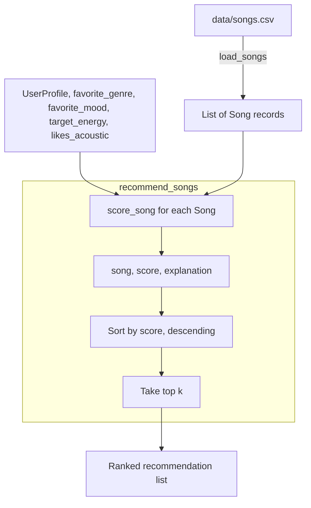

# 🎵 Music Recommender Simulation

## Project Summary

In this project you will build and explain a small music recommender system.

Your goal is to:

- Represent songs and a user "taste profile" as data
- Design a scoring rule that turns that data into recommendations
- Evaluate what your system gets right and wrong
- Reflect on how this mirrors real world AI recommenders

Replace this paragraph with your own summary of what your version does.

---

## How The System Works

**Real-world systems (Spotify/YouTube)**: These platforms rank content using two blended signals — collaborative filtering, which mines what millions of other users listened to, liked, skipped, or added to playlists to find "people like you also loved X," and content-based filtering, which matches a song or video's own attributes (genre, tempo, mood, energy) against your inferred taste profile. Collaborative signals dominate once enough behavioral data exists and surface non-obvious recommendations, while content signals handle cold-start cases (brand-new songs/users) and provide explainability.

**This system**: This recommender is a simplified, purely content-based version of that second half. It has no user population or listening history to mine — just a small Song catalog with hand-authored attributes (genre, mood, energy, tempo, valence, danceability, acousticness) and a single UserProfile describing one person's stated preferences (favorite genre/mood, target energy, acoustic preference). score_song compares each song's attributes to the user's profile and produces a numeric score plus a plain-language reason, and recommend_songs ranks the full catalog by that score and returns the top k — the same core mechanic real systems use for their content-based half, just without the collaborative, population-scale layer on top.



`score = w1*(1 - |energy_diff|) + w2*acoustic_match + w3*genre_bonus + w4*mood_bonus`, with w1, w2 largest since those two features have the most spread and best map to explicit user intent.

---

## Getting Started

### Setup

1. Create a virtual environment (optional but recommended):

   ```bash
   python -m venv .venv
   source .venv/bin/activate      # Mac or Linux
   .venv\Scripts\activate         # Windows

2. Install dependencies

```bash
pip install -r requirements.txt
```

3. Run the app:

```bash
python -m src.main
```

### Running Tests

Run the starter tests with:

```bash
pytest
```

You can add more tests in `tests/test_recommender.py`.

---

## Sample Recommendation Output

```
Sunrise City - Score: 0.94
Because: matches your favorite genre (pop); matches your favorite mood (happy); energy 0.82 is 0.02 away from your target 0.80; non-acoustic preference matches this song's acousticness (0.18)

Gym Hero - Score: 0.83
Because: matches your favorite genre (pop); energy 0.93 is 0.13 away from your target 0.80; non-acoustic preference matches this song's acousticness (0.05)

Rooftop Lights - Score: 0.68
Because: matches your favorite mood (happy); energy 0.76 is 0.04 away from your target 0.80; non-acoustic preference matches this song's acousticness (0.35)

Crown Speak - Score: 0.68
Because: energy 0.80 is 0.00 away from your target 0.80; non-acoustic preference matches this song's acousticness (0.08)

Broken Chain Riot - Score: 0.65
Because: energy 0.90 is 0.10 away from your target 0.80; non-acoustic preference matches this song's acousticness (0.05)
```

Stress Test with Diverse Profiles
```
=== Profile: High-Energy Pop ({'genre': 'pop', 'mood': 'happy', 'energy': 0.85}) ===
Top recommendations:

Sunrise City - Score: 0.93
Because: matches your favorite genre (pop); matches your favorite mood (happy); energy 0.82 is 0.03 away from your target 0.85; non-acoustic preference matches this song's acousticness (0.18)

Gym Hero - Score: 0.85
Because: matches your favorite genre (pop); energy 0.93 is 0.08 away from your target 0.85; non-acoustic preference matches this song's acousticness (0.05)

Broken Chain Riot - Score: 0.67
Because: energy 0.90 is 0.05 away from your target 0.85; non-acoustic preference matches this song's acousticness (0.05)

Rooftop Lights - Score: 0.66
Because: matches your favorite mood (happy); energy 0.76 is 0.09 away from your target 0.85; non-acoustic preference matches this song's acousticness (0.35)

Crown Speak - Score: 0.66
Because: energy 0.80 is 0.05 away from your target 0.85; non-acoustic preference matches this song's acousticness (0.08)


=== Profile: Chill Lofi ({'genre': 'lofi', 'mood': 'chill', 'energy': 0.35}) ===
Top recommendations:

Midnight Coding - Score: 0.76
Because: matches your favorite genre (lofi); matches your favorite mood (chill); energy 0.42 is 0.07 away from your target 0.35; non-acoustic preference does not match this song's acousticness (0.71)

Library Rain - Score: 0.74
Because: matches your favorite genre (lofi); matches your favorite mood (chill); energy 0.35 is 0.00 away from your target 0.35; non-acoustic preference does not match this song's acousticness (0.86)

Focus Flow - Score: 0.65
Because: matches your favorite genre (lofi); energy 0.40 is 0.05 away from your target 0.35; non-acoustic preference does not match this song's acousticness (0.78)

Island Sway - Score: 0.50
Because: energy 0.55 is 0.20 away from your target 0.35; non-acoustic preference matches this song's acousticness (0.40)

Spacewalk Thoughts - Score: 0.50
Because: matches your favorite mood (chill); energy 0.28 is 0.07 away from your target 0.35; non-acoustic preference does not match this song's acousticness (0.92)


=== Profile: Deep Intense Rock ({'genre': 'rock', 'mood': 'intense', 'energy': 0.9}) ===
Top recommendations:

Storm Runner - Score: 0.97
Because: matches your favorite genre (rock); matches your favorite mood (intense); energy 0.91 is 0.01 away from your target 0.90; non-acoustic preference matches this song's acousticness (0.10)

Gym Hero - Score: 0.77
Because: matches your favorite mood (intense); energy 0.93 is 0.03 away from your target 0.90; non-acoustic preference matches this song's acousticness (0.05)

Broken Chain Riot - Score: 0.69
Because: energy 0.90 is 0.00 away from your target 0.90; non-acoustic preference matches this song's acousticness (0.05)

Iron Fury - Score: 0.67
Because: energy 0.97 is 0.07 away from your target 0.90; non-acoustic preference matches this song's acousticness (0.02)

Neon Pulse Rave - Score: 0.67
Because: energy 0.95 is 0.05 away from your target 0.90; non-acoustic preference matches this song's acousticness (0.05)


=== Profile: Conflicting Energy/Mood ({'genre': 'rock', 'mood': 'sad', 'energy': 0.9}) ===
Top recommendations:

Storm Runner - Score: 0.87
Because: matches your favorite genre (rock); energy 0.91 is 0.01 away from your target 0.90; non-acoustic preference matches this song's acousticness (0.10)

Broken Chain Riot - Score: 0.69
Because: energy 0.90 is 0.00 away from your target 0.90; non-acoustic preference matches this song's acousticness (0.05)

Gym Hero - Score: 0.67
Because: energy 0.93 is 0.03 away from your target 0.90; non-acoustic preference matches this song's acousticness (0.05)

Iron Fury - Score: 0.67
Because: energy 0.97 is 0.07 away from your target 0.90; non-acoustic preference matches this song's acousticness (0.02)

Neon Pulse Rave - Score: 0.67
Because: energy 0.95 is 0.05 away from your target 0.90; non-acoustic preference matches this song's acousticness (0.05)


=== Profile: Out-of-Range Energy ({'genre': 'pop', 'mood': 'happy', 'energy': 1.5}) ===
Top recommendations:

Sunrise City - Score: 0.67
Because: matches your favorite genre (pop); matches your favorite mood (happy); energy 0.82 is 0.68 away from your target 1.50; non-acoustic preference matches this song's acousticness (0.18)

Gym Hero - Score: 0.66
Because: matches your favorite genre (pop); energy 0.93 is 0.57 away from your target 1.50; non-acoustic preference matches this song's acousticness (0.05)

Iron Fury - Score: 0.48
Because: energy 0.97 is 0.53 away from your target 1.50; non-acoustic preference matches this song's acousticness (0.02)

Neon Pulse Rave - Score: 0.46
Because: energy 0.95 is 0.55 away from your target 1.50; non-acoustic preference matches this song's acousticness (0.05)

Broken Chain Riot - Score: 0.45
Because: energy 0.90 is 0.60 away from your target 1.50; non-acoustic preference matches this song's acousticness (0.05)


=== Profile: Unknown Genre ({'genre': 'dubstep', 'mood': 'happy', 'energy': 0.7}) ===
Top recommendations:

Sunrise City - Score: 0.70
Because: matches your favorite mood (happy); energy 0.82 is 0.12 away from your target 0.70; non-acoustic preference matches this song's acousticness (0.18)

Rooftop Lights - Score: 0.67
Because: matches your favorite mood (happy); energy 0.76 is 0.06 away from your target 0.70; non-acoustic preference matches this song's acousticness (0.35)

Crown Speak - Score: 0.64
Because: energy 0.80 is 0.10 away from your target 0.70; non-acoustic preference matches this song's acousticness (0.08)

Night Drive Loop - Score: 0.61
Because: energy 0.75 is 0.05 away from your target 0.70; non-acoustic preference matches this song's acousticness (0.22)

Broken Chain Riot - Score: 0.60
Because: energy 0.90 is 0.20 away from your target 0.70; non-acoustic preference matches this song's acousticness (0.05)


=== Profile: Empty Preferences ({}) ===
Top recommendations:

Island Sway - Score: 0.56
Because: energy 0.55 is 0.05 away from your target 0.50; non-acoustic preference matches this song's acousticness (0.40)

Crown Speak - Score: 0.56
Because: energy 0.80 is 0.30 away from your target 0.50; non-acoustic preference matches this song's acousticness (0.08)

Noche Caliente - Score: 0.54
Because: energy 0.68 is 0.18 away from your target 0.50; non-acoustic preference matches this song's acousticness (0.30)

Night Drive Loop - Score: 0.53
Because: energy 0.75 is 0.25 away from your target 0.50; non-acoustic preference matches this song's acousticness (0.22)

Broken Chain Riot - Score: 0.52
Because: energy 0.90 is 0.40 away from your target 0.50; non-acoustic preference matches this song's acousticness (0.05)


=== Profile: Acoustic-Loving Metalhead ({'favorite_genre': 'metal', 'favorite_mood': 'angry', 'target_energy': 0.95, 'likes_acoustic': True}) ===
Top recommendations:

Iron Fury - Score: 0.70
Because: matches your favorite genre (metal); matches your favorite mood (angry); energy 0.97 is 0.02 away from your target 0.95; acoustic preference does not match this song's acousticness (0.02)

Mountain Promise - Score: 0.45
Because: energy 0.50 is 0.45 away from your target 0.95; acoustic preference matches this song's acousticness (0.75)

Coffee Shop Stories - Score: 0.44
Because: energy 0.37 is 0.58 away from your target 0.95; acoustic preference matches this song's acousticness (0.89)

Rooftop Lights - Score: 0.43
Because: energy 0.76 is 0.19 away from your target 0.95; acoustic preference does not match this song's acousticness (0.35)

Library Rain - Score: 0.42
Because: energy 0.35 is 0.60 away from your target 0.95; acoustic preference matches this song's acousticness (0.86)
```

**Screenshot or video** *(optional)*: <!-- Insert a screenshot or demo video link here -->

---

## Experiments You Tried

### Weight shift: double energy, halve genre

Changed the weights in `score_song` from `W_ENERGY=0.4, W_ACOUSTIC=0.3, W_GENRE=0.2, W_MOOD=0.1` to `W_ENERGY=0.8, W_ACOUSTIC=0.3, W_GENRE=0.1, W_MOOD=0.1` and re-ran all 8 profiles from the stress test above.

**Result: different, not more accurate.** There's no labeled/ground-truth data for this recommender (no real user feedback to check rankings against), so "accuracy" isn't actually measurable here — what changes is *which signal wins when preferences conflict*.

- **Clean profiles** (High-Energy Pop, Chill Lofi, Deep Intense Rock): the #1 recommendation never changed. Only 4th/5th place songs swapped, because doubling energy's weight let small energy-distance differences break ties that genre/mood used to settle. Low impact.
- **No-genre-signal profiles** (Unknown Genre, Empty Preferences): halving `W_GENRE` did *nothing* — `genre_bonus` was already 0 for every song in those cases, so all the reordering came from the energy boost alone.
- **Adversarial profile** (Acoustic-Loving Metalhead: `target_energy=0.95, likes_acoustic=True` — self-contradictory, since acoustic songs in this catalog skew low-energy) flipped completely:
  - Before: acoustic songs (Mountain Promise, Coffee Shop Stories, Library Rain) ranked high despite a bad energy match — the recommender effectively trusted `likes_acoustic` over `target_energy`.
  - After: high-energy non-acoustic songs (Neon Pulse Rave, Gym Hero, Storm Runner) took over the top slots — energy steamrolled the acoustic preference entirely.

Takeaway: these weights aren't just tuning "how good" recommendations are, they're deciding which contradictory user signal to believe when a profile is self-inconsistent. Reweighting toward energy makes the system resolve conflicts in energy's favor — a design/values choice, not a correctness fix, since there's no labeled data to say which resolution real users would actually prefer.

---

## Limitations and Risks

- **It only works on a tiny, hand-curated catalog** (20 songs). Several genres (metal, folk, jazz, classical, reggae, etc.) have exactly one entry, so a niche favorite_genre exhausts its genre match after one song, while well-represented genres (pop, lofi, rock) keep reinforcing themselves — a popularity bias baked into the catalog composition, not the algorithm.
- **It does not understand lyrics, language, or actual audio** — only hand-authored metadata tags (genre, mood, energy, acousticness, etc.), so any mislabeling in `data/songs.csv` propagates directly into recommendations with no way to catch it.
- **Genre and mood matching is exact-string, not semantic** ([recommender.py:108-109](src/recommender.py#L108-L109)): "pop" gets zero credit for "indie pop" or "synthwave" even though they're musically adjacent. This is the core filter-bubble mechanism — once a favorite_genre is set, the system only ever reinforces that exact label and never surfaces adjacent genres, even when their energy/acoustic fit is excellent.
- **No diversity-aware re-ranking** ([recommender.py:131-156](src/recommender.py#L131-L156)): `recommend_songs` just sorts by score and takes the top k, with no artist- or genre-diversity constraint. Artists with multiple catalog entries (e.g., "Neon Echo," "LoRoom") can dominate a single top-5 list, narrowing exposure even further within an already narrow genre lane.
- **Static, hand-picked weights encode designer assumptions, not validated user behavior** ([recommender.py:72-78](src/recommender.py#L72-L78)). `W_ENERGY` and `W_ACOUSTIC` are the largest weights because a comment says those features "have the most spread" — an untested assumption applied identically to every user, not something backed by real listening outcomes. See the weight-shift experiment above for how much this choice alone reshapes who "wins" when preferences conflict.
- **`likes_acoustic` is binary, flattening a spectrum into two poles** ([recommender.py:106](src/recommender.py#L106)). Unlike energy, which targets a continuous value, acoustic preference only rewards being near 0.0 or 1.0 acousticness — a user with moderate acoustic tolerance is pushed to an extreme rather than matched to their real nuance.
- **Missing profile fields silently default toward "mainstream"** ([recommender.py:98-101](src/recommender.py#L98-L101)): an unset `energy` becomes 0.5 and unset `likes_acoustic` becomes `False`. Incomplete profiles aren't treated neutrally — they're quietly steered toward mid-tempo, non-acoustic songs, structurally disadvantaging acoustic/ambient/quiet genres whenever profile data is sparse.
- **`tempo_bpm`, `valence`, and `danceability` are loaded but never scored**, so contradictions the data could catch (e.g., mood="sad" with high valence) are invisible to the algorithm — mood is trusted as a single subjective label with no independent check.
- **No feedback loop** — the profile is static input with no mechanism to learn from what a user actually likes once recommended. Once `favorite_genre`/`favorite_mood` are set, the same narrow slice of the catalog keeps surfacing indefinitely; nothing in the algorithm introduces exploration or novelty over time.

You will go deeper on this in your model card.

---

## Reflection

Read and complete `model_card.md`:

[**Model Card**](model_card.md)

Write 1 to 2 paragraphs here about what you learned:

- about how recommenders turn data into predictions
- about where bias or unfairness could show up in systems like this


