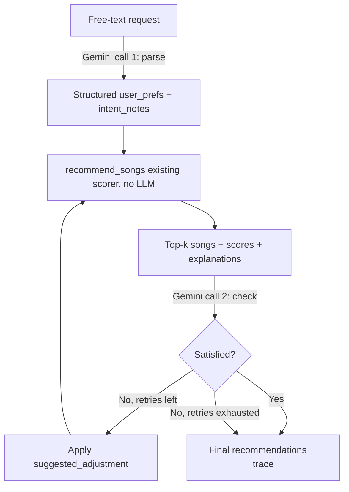

# Agentic Workflow Plan (SF8)

## Goal

Wrap the existing rule-based recommender (`score_song` / `recommend_songs` in
`src/recommender.py`) with an agent that accepts a free-text taste description,
turns it into the recommender's structured input, runs the recommender
unchanged, and then checks whether the results actually satisfy what the user
asked for — retrying with an adjustment if not. Plan -> Act -> Check -> Revise.

The recommender's scoring logic is not reimplemented or modified. The agent's
job is translation (free text -> structured profile) and judgment (does the
output satisfy the request), not arithmetic.

## Why wrap instead of replace

`score_song` only understands positive matches against a fixed set of numeric
fields (genre, mood, energy, acousticness). It has no way to represent
negative constraints ("not too sad") or soft context ("for studying"). Rather
than growing the scorer to handle every possible phrase, the agent handles
language understanding in a layer around the deterministic tool, keeping the
core recommender auditable and unchanged.

## Flow

1. **Input**
   User provides free text, e.g. *"I want something chill for studying, not
   too sad."*

2. **Plan — parse intent (Gemini call #1)**
   Send the text to Gemini with a JSON schema matching the recommender's
   existing keys (`genre`, `mood`, `energy`, `likes_acoustic`). Force
   structured output since this is a translation step, not a creative one.
   Also extract anything the scorer can't check itself into a separate
   `intent_notes` field:
   - negative constraints (e.g. "not too sad" -> exclude `mood == "sad"`)
   - soft context (e.g. "for studying" -> low-distraction preference)

3. **Act — run the existing recommender (no LLM)**
   Call `recommend_songs(user_prefs, songs, k)` as-is. The agent delegates
   scoring to the tool that's already implemented and tested.

4. **Check — judge the results (Gemini call #2)**
   Feed Gemini the original free-text request, the parsed preferences, and
   the top-k results (title, mood, energy, and the explanation string
   `score_song` already generates). Ask for a structured verdict:

   ```json
   {
     "satisfied": false,
     "violated_constraints": ["2 of the top 5 have mood == sad"],
     "suggested_adjustment": { "exclude_mood": ["sad"] }
   }
   ```

5. **Revise — retry with the adjustment**
   If unsatisfied and retries remain (capped at 2), apply the suggested
   adjustment — e.g. filter out excluded moods before rescoring, or nudge
   `target_energy` — and repeat from step 3.

6. **Return + trace**
   Return the final recommendations plus a short human-readable trace, e.g.:

   ```
   Attempt 1: excluded 2 sad-mood songs after check flagged them
   Attempt 2: satisfied
   ```

   This keeps the agent's revisions as explainable as the scores themselves.

7. **Bound it**
   Hard cap on retries (2). If still unsatisfied after the cap, return the
   best-effort list with an honest caveat instead of looping forever or
   letting the LLM invent catalog entries that don't exist in
   `data/songs.csv`.

## Diagram



## Code layout

- `src/agent.py` (new)
  - `parse_intent(text: str) -> dict` — Gemini call #1
  - `check_satisfaction(text: str, prefs: dict, recommendations: list) -> dict` — Gemini call #2
  - `recommend_from_text(text: str, songs: list, k: int = 5, max_retries: int = 2) -> tuple[list, list]` — owns the plan/act/check/revise loop; returns `(final_recommendations, trace)`
- `src/recommender.py` — unchanged; the agent calls `recommend_songs` directly.
- `tests/test_agent.py` (new) — mocks both Gemini calls (no network in tests/CI);
  specifically exercises the retry path by faking an "unsatisfied -> satisfied"
  sequence to prove the revise step changes the query.

## Open questions / follow-ups

- What retry cap is right for classroom demo purposes vs. latency? (Plan
  assumes 2.)
- Should `intent_notes` support more than mood exclusion (e.g. tempo,
  artist), or stay scoped to what the current catalog fields can express?
- Where does the Gemini API key come from — `.env` + `python-dotenv`, loaded
  via `GEMINI_API_KEY`?
